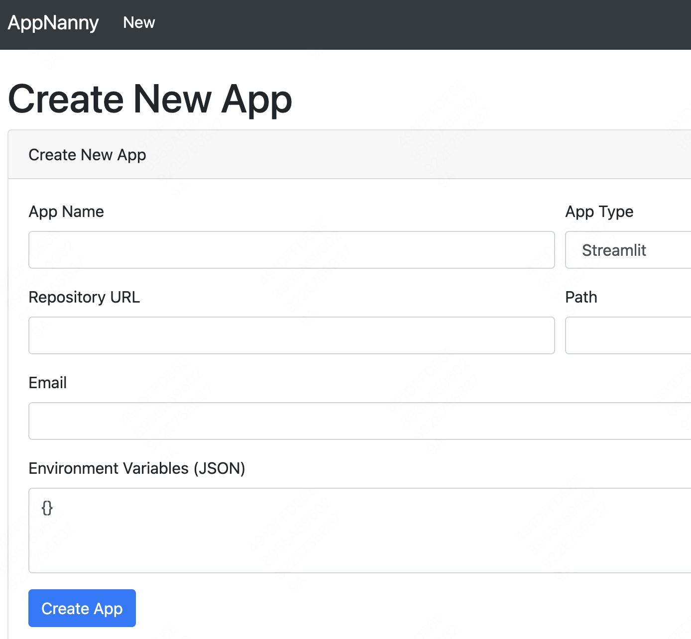
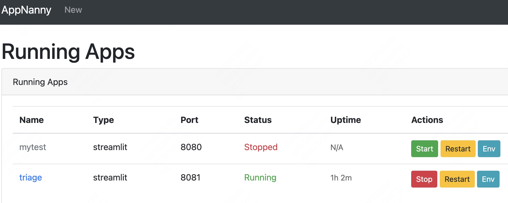
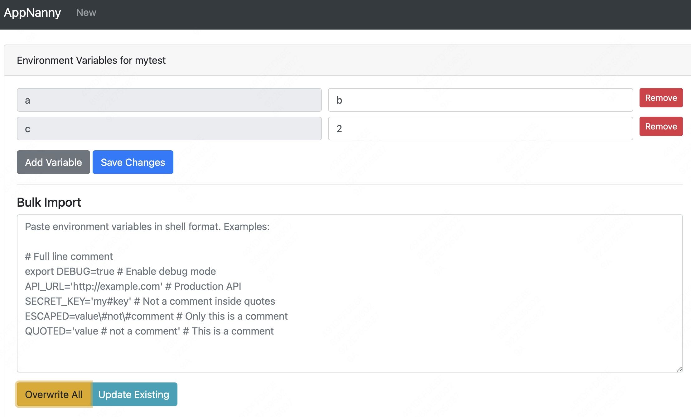

# AppNanny - 应用管理助手

## 项目简介
AppNanny 是一个轻量级的应用程序管理工具，用于自动化管理和监控本地运行的应用程序。它可以帮助开发者和系统管理员更好地控制开发环境中运行的应用程序，避免资源浪费。

### 主要特性
- 自动监控应用程序运行状态
- 智能检测和关闭长期闲置的应用
- 通过 Web 界面轻松管理应用
- 自动分配可用端口
- 详细的应用运行日志

## 快速开始

### 运行
```bash
# 启动 API 服务
python apps.py

# 启动调度器（新终端）
python scheduler.py
```

## 配置
系统默认配置：
- 应用闲置超时时间：3天
- 端口分配范围：8000-9000
- 日志存储：rotating logs

## 使用说明
1. 通过管理界面添加新应用

2. 监控应用运行状态
3. 查看应用日志
4. 手动启动/停止应用

5. 配置应用环境变量


## TODO
- 去掉 apps_metadata.json 文件，把内容都写到app各自的目录里
- 在app目录里增加一个.appnanny目录，把相关的文件挪到目录里
- 增加一个删除按钮，把对应的app停掉，并把对应的目录删除（挪到workspace的.backup目录）
- 实现scheduler
- 实现proxy